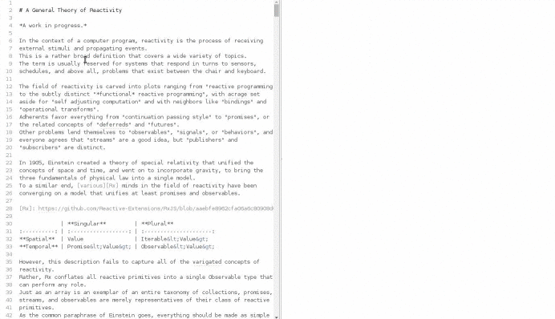

# Markdown Mindmap package

Type `mind` in the Atom command palette to open a mindmap view of the current markdown file. The full command name is `Markdown Mindmap: Toggle`.

This extension is built using the [markmap](https://github.com/dundalek/markmap) component.

Suggestions for new featues are welcome, feel free to open an [issue](https://github.com/dundalek/atom-markdown-mindmap/issues).
